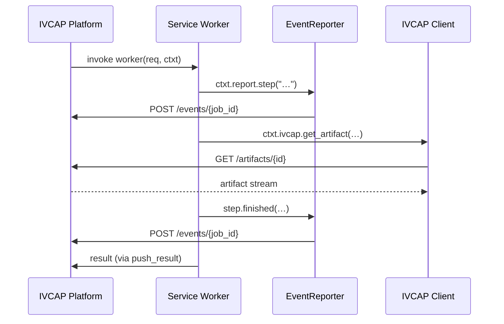

# JobContext

`JobContext` is the gateway to the IVCAP platform from within your job worker function.
It is passed automatically as the second argument to every worker function and provides:

- **Job identity** — the unique ID and platform-injected authorisation token for the current job.
- **Progress & event reporting** — a pre-configured [`EventReporter`](events.md) for emitting structured step events back to the platform.
- **Full IVCAP platform access** — a lazy-initialized, pre-authenticated [`IVCAP`](#the-ivcap-client) client from the [ivcap-client](https://github.com/ivcap-works/ivcap-client-sdk-python) library for uploading/downloading artifacts, querying metadata, and calling other services.

```python
from ivcap_service import JobContext

def process_job(req: MyRequest, ctxt: JobContext) -> MyResult:
    # Identity
    logger.info(f"Processing job {ctxt.job_id}")

    # Progress reporting
    with ctxt.report.step("analysis", msg="Analysing input") as step:
        result = analyse(req.data)
        step.finished(msg="Analysis complete")

    # Platform access
    artifact = ctxt.ivcap.get_artifact(req.input_urn)
    with artifact.as_local_file() as path:
        data = path.read_bytes()

    return MyResult(output=result)
```

---

## Properties

### `job_id` · `str`

The platform-assigned unique identifier for this job (e.g. `urn:ivcap:job:...`).
Use this in log messages and when correlating events or results.

```python
logger.info(f"Starting job {ctxt.job_id}")
```

---

### `report` · `EventReporter`

A fully configured [`EventReporter`](events.md) instance for emitting structured progress events during execution.
The reporter uses the platform sidecar when running on IVCAP, and falls back to structured logging locally.

**Quick reference:**

```python
# Context-manager style (recommended)
with ctxt.report.step("load", msg="Loading data") as step:
    data = load(req.source)
    step.finished(msg=f"Loaded {len(data)} records")

# Direct-call style (for async or conditional reporting)
ctxt.report.step_started("analysis", msg="Starting analysis")
ctxt.report.step_info("analysis", msg="50% done")       # (1)
ctxt.report.step_finished("analysis", msg="Done")
```

1. `step_info` is called `step_info` in the `EventReporter`; it takes `step_name` and `msg`.

For full details on event types, the `EventContext` step object, and custom reporters see
**[Events & Reporting API →](events.md)**

---

### `ivcap` · `IVCAP`

A lazy-initialized, pre-authenticated client from the [`ivcap-client`](https://github.com/ivcap-works/ivcap-client-sdk-python) library.
It is instantiated on first access — no credentials or configuration are required inside a platform job container.

```python
ivcap = ctxt.ivcap   # property access, no parentheses
```

The client is the primary entry point for all platform interactions:

| What you want to do | Method / starting point |
|---|---|
| Download an input artifact | `ivcap.get_artifact(urn)` |
| Upload a result artifact | `ivcap.upload_artifact(...)` |
| Attach metadata to an entity | `ivcap.add_aspect(entity, aspect)` |
| List or query existing aspects | `ivcap.list_aspects(entity=...)` |
| Call another IVCAP service | `ivcap.get_service_by_name(...)` → `.request_job(...)` |
| List available services | `ivcap.list_services(...)` |

**Working with artifacts →** [Artifacts Guide](../guides/artifacts.md)

**Calling other services →** [Service Composition Guide](../guides/service-composition.md)

---

### `job_authorization` · `str | None`

The Bearer token injected by the platform for the current job.
This is used internally by the SDK to authenticate outbound HTTP calls (via the `requests` and `httpx` monkey-patches in `context.py`) and by the `EventReporter` when posting events to the sidecar.

You rarely need to access this directly — the `ivcap` client and the HTTP instrumentation layer use it automatically.

---

## Execution flow



---

## API Reference

::: ivcap_service.types.JobContext
