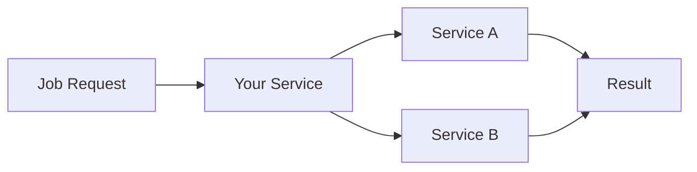

# Service Composition Guide

Compose multiple IVCAP services to build complex workflows from within your job worker.

## Overview

Service composition allows your service to discover and invoke other IVCAP services,
enabling powerful patterns like pipelines, fan-out/fan-in, and conditional routing.

The `ctxt.ivcap` client is pre-authenticated — no credentials are required when
running inside a platform job container.



## Accessing the IVCAP Client

```python
def process_job(req: Request, ctxt: JobContext) -> Result:
    ivcap = ctxt.ivcap  # property — no parentheses
    ...
```

## Service Discovery

### Find a service by name

```python
def process_job(req: Request, ctxt: JobContext) -> Result:
    ivcap = ctxt.ivcap

    # Look up a service by its registered name
    downstream = ivcap.get_service_by_name("image-processor")

    return Result()
```

### Find a service by URN

```python
def process_job(req: Request, ctxt: JobContext) -> Result:
    ivcap = ctxt.ivcap

    downstream = ivcap.get_service("urn:ivcap:service:my-service-uuid")

    return Result()
```

### List all available services

```python
def process_job(req: Request, ctxt: JobContext) -> Result:
    ivcap = ctxt.ivcap

    for svc in ivcap.list_services(limit=50):
        logger.info(f"Available: {svc.name} ({svc.id})")

    return Result()
```

## Calling Services

### Simple Invocation

Use `service.request_job(req_model, timeout=N)` to submit a job and wait for the
result.  Pass a Pydantic model (or a `dict` / `IO[str]` of JSON) as the request.

```python
def process_job(req: Request, ctxt: JobContext) -> Result:
    ivcap = ctxt.ivcap

    downstream = ivcap.get_service_by_name("my-downstream-service")
    DownstreamReq = downstream.request_model

    job = downstream.request_job(
        DownstreamReq(input_data=req.data, options=req.options),
        timeout=300,  # wait up to 5 minutes
    )

    if job.succeeded:
        logger.info(f"Downstream result: {job.result}")
    else:
        logger.error(f"Downstream job failed: {job.status()}")
        raise RuntimeError("Downstream service failed")

    return Result(result=job.result)
```

### With Progress Reporting

```python
def process_job(req: Request, ctxt: JobContext) -> Result:
    ivcap = ctxt.ivcap

    downstream = ivcap.get_service_by_name("my-service")
    DownstreamReq = downstream.request_model

    with ctxt.report.step("call_service", msg="Calling downstream service") as step:
        try:
            job = downstream.request_job(
                DownstreamReq(data=req.data),
                timeout=120,
            )
            step.finished(msg=f"Service completed with status: {job.status()}")
        except Exception as e:
            logger.error(f"Service call failed: {e}")
            raise

    return Result(result=job.result)
```

## Common Patterns

### Pipeline Composition

Chain services sequentially, passing results from one stage to the next:

```python
def process_job(req: Request, ctxt: JobContext) -> Result:
    ivcap = ctxt.ivcap

    validate_svc = ivcap.get_service_by_name("validate-service")
    transform_svc = ivcap.get_service_by_name("transform-service")
    enrich_svc = ivcap.get_service_by_name("enrich-service")

    with ctxt.report.step("validate", msg="Validating") as s:
        ValidateReq = validate_svc.request_model
        validated_job = validate_svc.request_job(ValidateReq(data=req.data), timeout=60)
        s.finished(msg="Validation complete")

    with ctxt.report.step("transform", msg="Transforming") as s:
        TransformReq = transform_svc.request_model
        transformed_job = transform_svc.request_job(
            TransformReq(data=validated_job.result), timeout=120
        )
        s.finished(msg="Transform complete")

    with ctxt.report.step("enrich", msg="Enriching") as s:
        EnrichReq = enrich_svc.request_model
        enriched_job = enrich_svc.request_job(
            EnrichReq(data=transformed_job.result), timeout=120
        )
        s.finished(msg="Enrichment complete")

    return Result(result=enriched_job.result)
```

### Parallel Fan-Out

Dispatch multiple downstream jobs in parallel, then aggregate results:

```python
import time

def process_job(req: Request, ctxt: JobContext) -> Result:
    ivcap = ctxt.ivcap

    processor = ivcap.get_service_by_name("batch-processor")
    ProcessorReq = processor.request_model

    # Dispatch all jobs without waiting (timeout=0 returns immediately)
    jobs = []
    for item in req.items:
        job = processor.request_job(ProcessorReq(data=item), timeout=0)
        jobs.append(job)

    logger.info(f"Dispatched {len(jobs)} parallel jobs")

    # Poll until all jobs finish
    completed = []
    with ctxt.report.step("wait_for_jobs", msg="Waiting for results") as step:
        while len(completed) < len(jobs):
            for job in jobs:
                if job not in completed:
                    job.refresh()
                    if job.finished:
                        logger.info(f"Job {job.id} finished: {job.status()}")
                        completed.append(job)
            if len(completed) < len(jobs):
                step.info(event={"completed": len(completed), "total": len(jobs)})
                time.sleep(5)

        step.finished(msg=f"All {len(jobs)} jobs finished")

    results = [j.result for j in jobs if j.succeeded]
    return Result(results=results, all_succeeded=all(j.succeeded for j in jobs))
```

### Conditional Routing

Route to different services based on input properties:

```python
def process_job(req: Request, ctxt: JobContext) -> Result:
    ivcap = ctxt.ivcap

    # Choose service based on data size
    if req.data_size_mb < 10:
        svc_name = "fast-processor"
    elif req.data_size_mb < 100:
        svc_name = "standard-processor"
    else:
        svc_name = "heavy-processor"

    svc = ivcap.get_service_by_name(svc_name)
    SvcReq = svc.request_model

    with ctxt.report.step("process", msg=f"Using {svc_name}") as step:
        job = svc.request_job(SvcReq(data=req.data), timeout=600)
        step.finished(msg=f"Completed via {svc_name}")

    return Result(result=job.result)
```

### Graceful Degradation with Fallback

Try a primary service and fall back gracefully on failure:

```python
from ivcap_client.exception import ResourceNotFound, IvcapApiError

def process_job(req: Request, ctxt: JobContext) -> Result:
    ivcap = ctxt.ivcap

    with ctxt.report.step("process", msg="Processing") as step:
        try:
            hq_svc = ivcap.get_service_by_name("hq-processor")
            HqReq = hq_svc.request_model
            job = hq_svc.request_job(HqReq(data=req.data), timeout=120)
            step.finished(msg="High-quality processing complete")
        except (ResourceNotFound, IvcapApiError) as e:
            logger.warning(f"HQ service unavailable ({e}), using fallback")
            step.info(event={"fallback": True})

            fallback_svc = ivcap.get_service_by_name("fallback-processor")
            FallbackReq = fallback_svc.request_model
            job = fallback_svc.request_job(FallbackReq(data=req.data), timeout=60)
            step.finished(msg="Fallback processing complete")

    return Result(result=job.result)
```

### Map-Reduce

Submit a large number of jobs and aggregate their outputs:

```python
import time

def process_job(req: Request, ctxt: JobContext) -> Result:
    ivcap = ctxt.ivcap

    mapper = ivcap.get_service_by_name("item-mapper")
    reducer = ivcap.get_service_by_name("result-reducer")
    MapperReq = mapper.request_model
    ReducerReq = reducer.request_model

    # Map phase: fan out
    map_jobs = [
        mapper.request_job(MapperReq(item=item), timeout=0)
        for item in req.items
    ]

    # Wait for all map jobs
    while not all(j.finished for j in map_jobs):
        for j in map_jobs:
            if not j.finished:
                j.refresh()
        time.sleep(2)

    mapped_results = [j.result for j in map_jobs if j.succeeded]

    # Reduce phase
    with ctxt.report.step("reduce", msg="Reducing results") as step:
        reduce_job = reducer.request_job(ReducerReq(items=mapped_results), timeout=120)
        step.finished()

    return Result(result=reduce_job.result)
```

## See Also

- [Job Processing](job-processing.md) — Core patterns
- [Artifacts](artifacts.md) — Passing artifact URNs between services
- [Error Handling](error-handling.md) — Robust service calls
- [ivcap-client SDK — Services](https://ivcap-works.github.io/ivcap-client-sdk-python/guides/services/) — Full service-discovery reference
- [ivcap-client SDK — Jobs](https://ivcap-works.github.io/ivcap-client-sdk-python/guides/jobs/) — Job submission and monitoring
