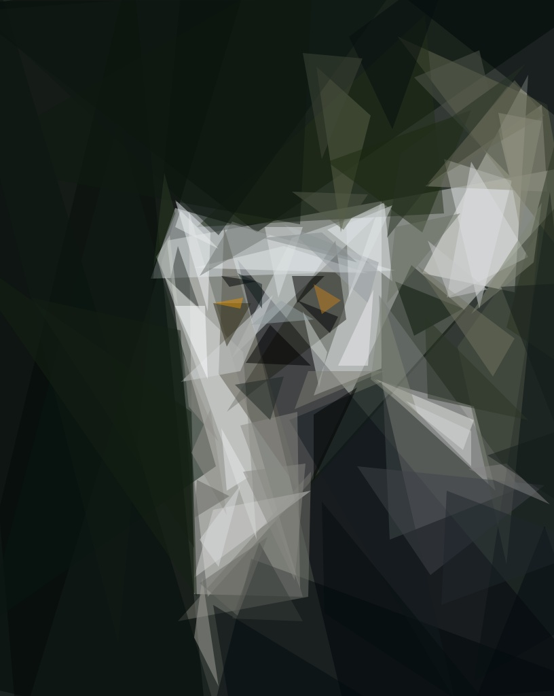

<!--
Copyright (c) 2023 Commonwealth Scientific and Industrial Research Organisation (CSIRO). All rights reserved.
Use of this source code is governed by a BSD-style license that can be
found in the LICENSE file. See the AUTHORS file for names of contributors.
-->
# Introduction
This folder contains an example of how to package up [primitive](https://github.com/fogleman/primitive), a command line application written in `Go`, and make it available via IVCAP.

# Features 
[primitive](https://github.com/fogleman/primitive) is designed to recreate your photos with vector-based geometric primitives. The user provides an image as an input and `primitive` tries to find the most optimal shape that can be drawn to maximize the similarity between the target image and the drawn image. It repeats this process, adding one shape at a time.

Below are before and after examples:




# Usage

Follow these steps to set up and use the `ivcap_sdk_service`:

1. Change to the top-level directory of the project:

   ```bash
   cd /path/to/top/level/directory
   ```

2. Create a Python virtual environment:

   ```bash
   python3 -m venv .venv
   ```

3. Activate the virtual environment:

   ```bash
   source .venv/bin/activate
   ```

4. Install required Python packages using pip:

   ```bash
   pip install poetry licenseheaders pillow typing_extensions
   ```

5. Build the project using Poetry:

   ```bash
   make build
   ```

6. Install the built package:

   ```bash
   pip install dist/ivcap_sdk_service-0.3.1.tar.gz
   ```

7. Change to the examples/primitive directory:

   ```bash
   cd examples/primitive
   ```

8. Build a Docker image named `primitive_service` for running the Primitive package as a service on IVCAP:

   ```bash
   make build-docker-image
   ```

9. Publish the Docker container to a container registry:

   ```bash
   make docker-publish
   ```

10. View the service description defined in `examples/primitive/service.py`:

    ```bash
    make service-description
    ```

11. Register the Docker image `primitive_service` to IVCAP:

    ```bash
    make service-register
    ```

12. Verify the service registration by checking the service list:

    ```bash
    ivcap service list
    ```

    Output:

    ```bash                                                                                
    +----+-----------+---------------------------------------------------------+
    | ID | NAME      | PROVIDER                                                |
    +----+-----------+---------------------------------------------------------+
    | @1 | primitive | urn:ivcap:provider:e91bb525-83b7-4641-9fb8-b61d084a9b81 |
    +----+-----------+---------------------------------------------------------+
    ```

    ```bash
    (.venv) ➜  primitive git:(primitive_example) ✗ ivcap service get @1
    ```

    Output:
    ```bash
            ID  urn:ivcap:service:53d4033f-8e34-5f9e-9925-df5bb88134e4                
            Name  primitive                                                             
    Description  Reproduce images with geometric primitives.                           
        Status  ???                                                                   
    Provider ID  urn:ivcap:provider:e91bb525-83b7-4641-9fb8-b61d084a9b81               
    Account ID  urn:ivcap:account:e91bb525-83b7-4641-9fb8-b61d084a9b81                
    Parameters  ┌─────────────┬────────────────────────────────┬──────────┬─────────┐ 
                │ NAME        │ DESCRIPTION                    │ TYPE     │ DEFAULT │ 
                ├─────────────┼────────────────────────────────┼──────────┼─────────┤ 
                │ input_image │ input file                     │ artifact │ ???     │ 
                ├─────────────┼────────────────────────────────┼──────────┼─────────┤ 
                │           n │ number of shapes               │ int      │ 100     │ 
                ├─────────────┼────────────────────────────────┼──────────┼─────────┤ 
                │           m │ mode: 0=combo, 1=triangle, 2=r │ int      │ 1       │ 
                │             │ ect, 3=ellipse, 4=cirle, 5=rot │          │         │ 
                │             │ atedrect, 6=beziers, 7=rotated │          │         │ 
                │             │ ellipse, 8=polygon             │          │         │ 
                ├─────────────┼────────────────────────────────┼──────────┼─────────┤ 
                │         rep │ add N extra shapes each iterat │ int      │ 0       │ 
                │             │ ion with reduced search (mostl │          │         │ 
                │             │ y good for beziers)            │          │         │ 
                ├─────────────┼────────────────────────────────┼──────────┼─────────┤ 
                │         nth │ save every Nth frame (only whe │ int      │ 1       │ 
                │             │ n %d is in output path)        │          │         │ 
                ├─────────────┼────────────────────────────────┼──────────┼─────────┤ 
                │           r │ resize large input images to t │ int      │ 256     │ 
                │             │ his size before processing     │          │         │ 
                ├─────────────┼────────────────────────────────┼──────────┼─────────┤ 
                │           s │ output image size              │ int      │ 1024    │ 
                ├─────────────┼────────────────────────────────┼──────────┼─────────┤ 
                │           a │ color alpha (use 0 to let the  │ int      │ 128     │ 
                │             │ algorithm choose alpha for eac │          │         │ 
                │             │ h shape)                       │          │         │ 
                ├─────────────┼────────────────────────────────┼──────────┼─────────┤ 
                │          bg │ starting background color (hex │ string   │ avg     │ 
                │             │ )                              │          │         │ 
                ├─────────────┼────────────────────────────────┼──────────┼─────────┤ 
                │           j │ number of parallel workers (de │ int      │ 0       │ 
                │             │ fault uses all cores)          │          │         │ 
                └─────────────┴────────────────────────────────┴──────────┴─────────┘ 
    ```    

13. To test the service, you need to upload an artifact to IVCAP. Use the following command and replace `io/input/lemur.jpg` with your artifact path:

    ```bash
    ivcap artifact create -f io/input/lemur.jpg
    ```

    Output:
    ```bash
    Created artifact 'urn:ivcap:artifact:7d6d173c-8ac1-4667-aa14-b2e4155d8dd2'
    ... uploading file 100% [==============================] (19 MB/s)
    
    Completed uploading 'urn:ivcap:artifact:7d6d173c-8ac1-4667-aa14-b2e4155d8dd2'
            ID  urn:ivcap:artifact:7d6d173c-8ac1-4667-aa14-b2e4155d8dd2 
        Name  7d6d173c-8ac1-4667-aa14-b2e4155d8dd2                    
        Status  ready                                                   
        Size  26 kB                                                   
    Mime-type  image/jpeg                                              
    Account ID  urn:ivcap:account:e91bb525-83b7-4641-9fb8-b61d084a9b81  
    Metadata   
    ```    

14. To view the uploaded artifact, run:

    ```bash
    ivcap artifact list
    ```

    Output:
    ```bash
    +----+--------------------------------+--------+---------+------------+
    | ID | NAME                           | STATUS | SIZE    | MIMETYPE   |
    +----+--------------------------------+--------+---------+------------+
    | @1 | 2785c61f-7515-4d15-b2ac-11d... | ready  | 68 kB   | image/jpeg |
    +----+--------------------------------+--------+---------+------------+    
    ```

15. To create an order using the uploaded artifact and the service, run:

    ```bash
    ivcap orders create --name "lemur-primitive" urn:ivcap:service:53d4033f-8e34-5f9e-9925-df5bb88134e4 input_image=urn:ivcap:artifact:2785c61f-7515-4d15-b2ac-11d5dee857aa n=100
    ```

    Output:
    ```bash
    Order 'urn:ivcap:order:6d88edf9-c081-4435-b0ba-e1a135bdb3bc' with status 'pending' submitted.    
    ```    

16. Check the status of the order by running:

    ```bash
    ivcap orders get urn:ivcap:order:6d88edf9-c081-4435-b0ba-e1a135bdb3bc
    ```

    Output:
    ```bash
             ID  urn:ivcap:order:6d88edf9-c081-4435-b0ba-e1a135bdb3bc                            
           Name  lemur-primitive                                                                 
         Status  executing                                                                       
        Ordered  27 seconds ago (15 Sep 23 16:00 AEST)                                           
        Service  primitive (@7)                                                                  
     Account ID  urn:ivcap:account:e91bb525-83b7-4641-9fb8-b61d084a9b81                          
     Parameters  ┌─────────────────────────────────────────────────────────────────────────────┐ 
                 │ input_image =  @1 (urn:ivcap:artifact:2785c61f-7515-4d15-b2ac-11d5dee857aa) │ 
                 │           n =  100                                                          │ 
                 │           m =  1                                                            │ 
                 │         rep =  0                                                            │ 
                 │         nth =  1                                                            │ 
                 │           r =  256                                                          │ 
                 │           s =  1024                                                         │ 
                 │           a =  128                                                          │ 
                 │          bg =  avg                                                          │ 
                 │           j =  0                                                            │ 
                 └─────────────────────────────────────────────────────────────────────────────┘ 
       Products  ┌────┬─────────────────────────────────────────┬────────────┐                   
                 │ @2 │ /tmp/tmpqgacpzbg/input/input_output.jpg │ image/jpeg │                   
                 └────┴─────────────────────────────────────────┴────────────┘                   
       Metadata  ┌────┬────────────────────────────────────────────┐                             
                 │ @3 │ urn:ivcap:schema:order-produced-artifact.1 │                             
                 │ @4 │ urn:ivcap:schema:order-uses-artifact.1     │                             
                 │ @5 │ urn:ivcap:schema:order-placed.1            │                             
                 │ @6 │ urn:ivcap:schema:order-uses-workflow.1     │                             
                 └────┴────────────────────────────────────────────┘        
    ```

17. Download the resulting artifact from the order:

    ```bash
    ivcap artifact get @2
    ```

    Output:
    ```bash
             ID  urn:ivcap:artifact:e94a89a3-1108-488b-9380-fbbd72d59f49 
           Name  /tmp/tmpqgacpzbg/input/input_output.jpg                 
         Status  ready                                                   
           Size  99 kB                                                   
      Mime-type  image/jpeg                                              
     Account ID  urn:ivcap:account:e91bb525-83b7-4641-9fb8-b61d084a9b81  
       Metadata  ┌────┬──────────────────────────────────────────┐       
                 │ @1 │ urn:ivcap:schema:artifact-usedBy-order.1 │       
                 │ @2 │ urn:ivcap:schema:artifact.1              │       
                 └────┴──────────────────────────────────────────┘      
    ```    

    ```bash
    ivcap artifact download urn:ivcap:artifact:e94a89a3-1108-488b-9380-fbbd72d59f49 -f io/output/lemur.jpg
    ```

    Output:
    ```
    ... downloading file 100% [==============================] (38 MB/s)       
    ```

    ```bash
    open io/output/lemur.jpg
    ```
        

Now you have successfully set up and used the `ivcap_sdk_service`.

## Acknowledgements:
- [Primitive](https://github.com/fogleman/primitive) created by [@fogleman](https://github.com/fogleman).
- [Lemur](app/input/lemur.jpg) photo by <a href="https://unsplash.com/@edgar_infocus?utm_source=unsplash&utm_medium=referral&utm_content=creditCopyText">Edgar.infocus</a> on <a href="https://unsplash.com/photos/a-close-up-of-a-small-animal-with-orange-eyes-R1nQaXqYMus?utm_source=unsplash&utm_medium=referral&utm_content=creditCopyText">Unsplash</a>.